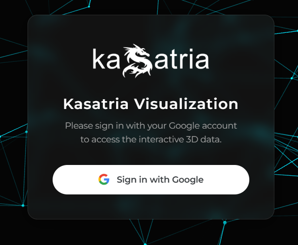
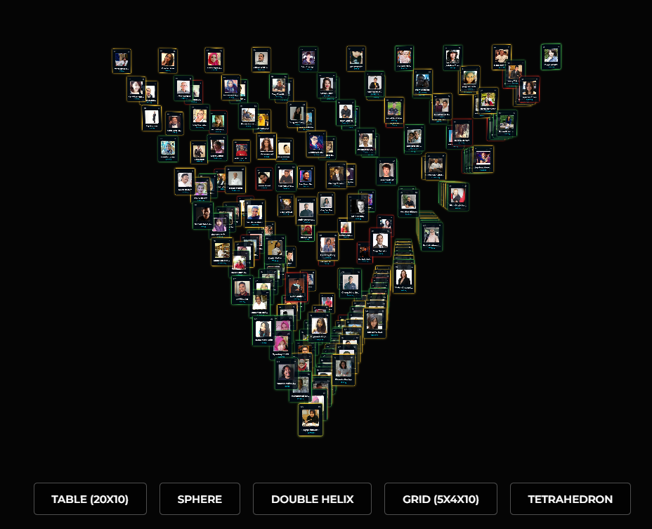
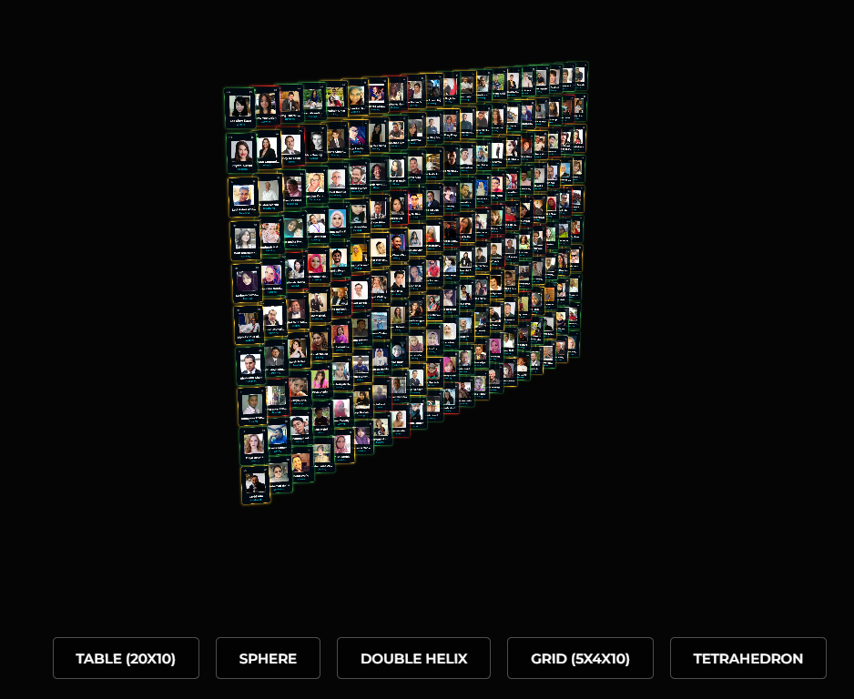
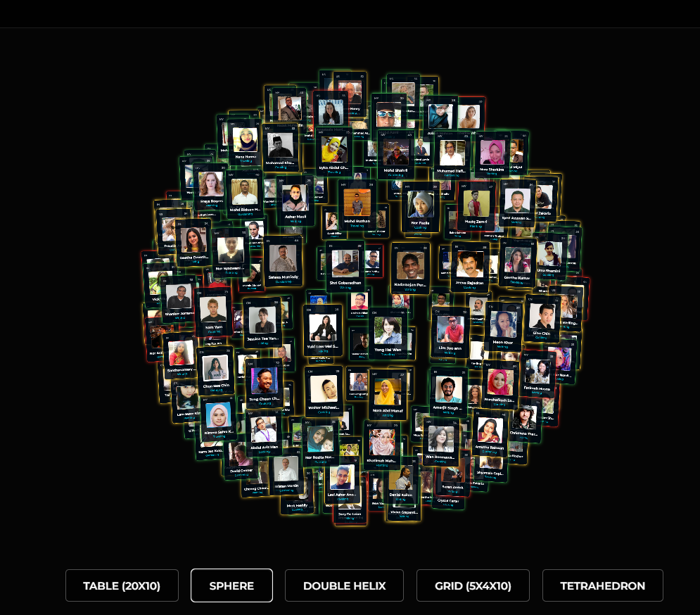

# Kasatria 3D Data Visualization

An interactive 3D visualization platform that fetches live personnel data from Google Sheets and renders it into dynamic geometric formations using CSS3D rendering.

**[🔴 LIVE DEMO](https://guestgithub2.github.io/kasatria-visualization/)**

---

## 📸 Screenshots

| Login Screen | Tetrahedron Layout |
|:---:|:---:|
|  |  |
| *Secure Google OAuth 2.0 Login* | *Dynamic 4-Face Pyramid Layout* |

| Table Layout | Sphere Layout |
|:---:|:---:|
|  |  |
| *20x10 Periodic Table View* | *3D Spherical Distribution* |

---

## 🚀 Key Features

* **⚡ Real-time Data Integration:** Fetches live rows (Name, Photo, Net Worth, etc.) directly from a secured Google Sheet using the Google Sheets API v4.
* **🔐 Secure Authentication:** Implements Google OAuth 2.0 with restricted API keys (HTTP Referrer locked).
* **💠 5 Dynamic Layouts:**
    * **Table:** Standard Periodic Table arrangement ($20 \times 10$).
    * **Sphere:** Mathematical spherical distribution.
    * **Double Helix:** DNA-like spiral structure.
    * **Grid:** Deep 3D box alignment ($5 \times 4 \times 10$).
    * **Tetrahedron:** (New) 4-faced pyramid structure calculated via barycentric coordinates.
* **🎨 Advanced UI/UX:**
    * "Glassmorphism" design system.
    * Interactive particle network background (Vanta.js) on login.
    * Dynamic card coloring based on financial thresholds (Red/Orange/Green).

---

## 🛠️ Tech Stack

* **Frontend:** HTML5, CSS3, Vanilla JavaScript (ES6+)
* **3D Engine:** [Three.js](https://threejs.org/) (CSS3DRenderer)
* **Data Source:** Google Sheets API
* **Auth:** Google Identity Services (GIS)
* **Effects:** Tween.js (Animations), Vanta.js (Backgrounds)

---

## 🎮 Controls

* **Left Click + Drag:** Rotate the camera.
* **Right Click + Drag:** Pan the camera.
* **Scroll Wheel:** Zoom in/out.
* **Menu Buttons:** Switch between 3D formations smoothly.

---

## 👤 Author

**Abdullah Shahid**
* Assignment submission for Kasatria Technologies.
